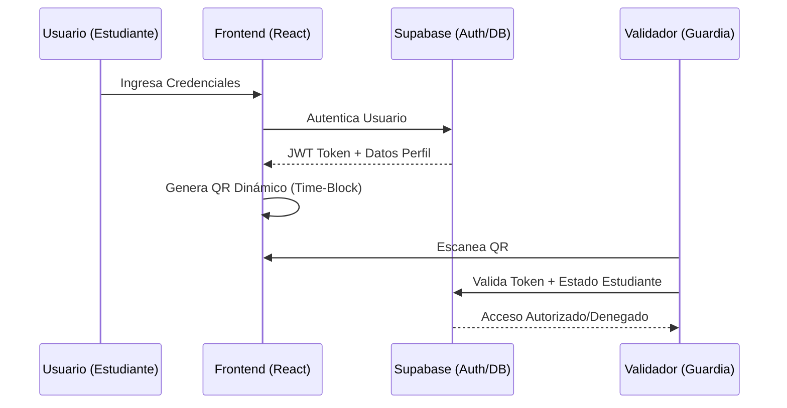

# Documentación Técnica: Arquitectura y API

Este documento detalla la infraestructura, los modelos de datos y los flujos de comunicación del sistema **UniSalamanca Digital**.

## 1. Arquitectura del Sistema
El sistema utiliza un patrón de arquitectura moderna basado en **React** para el frontend y **Supabase** como plataforma Backend-as-a-Service (BaaS).

### Diagrama de Flujo (Autenticación y QR)


## 2. Documentación de la Base de Datos (API)
La comunicación con el backend se realiza mediante la librería `@supabase/supabase-js`, exponiendo las siguientes entidades principales:

### Tablas Principales
| Tabla | Descripción | Campos Clave |
| :--- | :--- | :--- |
| `public.user` | Entidad central de identidad. | `id`, `email`, `status`, `plate_number`, `photo_status`. |
| `public.characterization` | Datos socio-demográficos y académicos. | `user_id`, `gender`, `ethnicity`, `study_modality`. |
| `public.access_log` | Registro histórico de ingresos. | `user_id`, `timestamp`, `location` (GIS). |
| `public.academic_record` | Información de cursos y notas. | `user_id`, `subject_id`, `grade`. |

### Seguridad (RLS - Row Level Security)
Se aplican políticas de seguridad a nivel de fila para garantizar que el estudiante solo acceda a sus propios datos, mientras que los administradores tienen acceso global.
- `SELECT`: `auth.uid() = user_id`
- `UPDATE`: Solo campos específicos (ej. foto de perfil) permitidos para el usuario.

## 3. Lógica de Código Crítica

### Algoritmo de QR Dinámico (Antifraude)
El sistema genera un token basado en el tiempo para evitar que capturas de pantalla sean reutilizadas:

```javascript
// Lógica simplificada
const timeBlock = Math.floor(Date.now() / 30000); // Bloques de 30s
const payload = `UNIS|${studentId}|${timeBlock}`;
const qrToken = encrypt(payload); // Token firmado
```

El validador permite una ventana de ±1 bloque (máximo 60 segundos de latencia) para compensar desincronizaciones de reloj.

### Integración de Servicios (Micro-Interfaces)
El dashboard principal carga componentes perezosos (Lazy-loading) para módulos como:
- **FinanceView**: Conexión con estados de cuenta reales.
- **LibraryView**: Consulta de disponibilidad de libros y multas.
- **SalmiAI**: Asistente basado en LLM con conocimiento institucional cargado vía RAG (Retrieval Augmented Generation).

## 4. Requisitos del Sistema
- **Browsers:** Chrome 100+, Safari 15+, Firefox 90+.
- **Conectividad:** Requiere conexión a internet activa para validación en tiempo real.
- **Cámara:** El dispositivo validador requiere cámara con autofocus para escaneo de QR.

---
[Volver al README](file:///c:/Users/reyna/Desktop/unisalamanca-digital/README.md)
